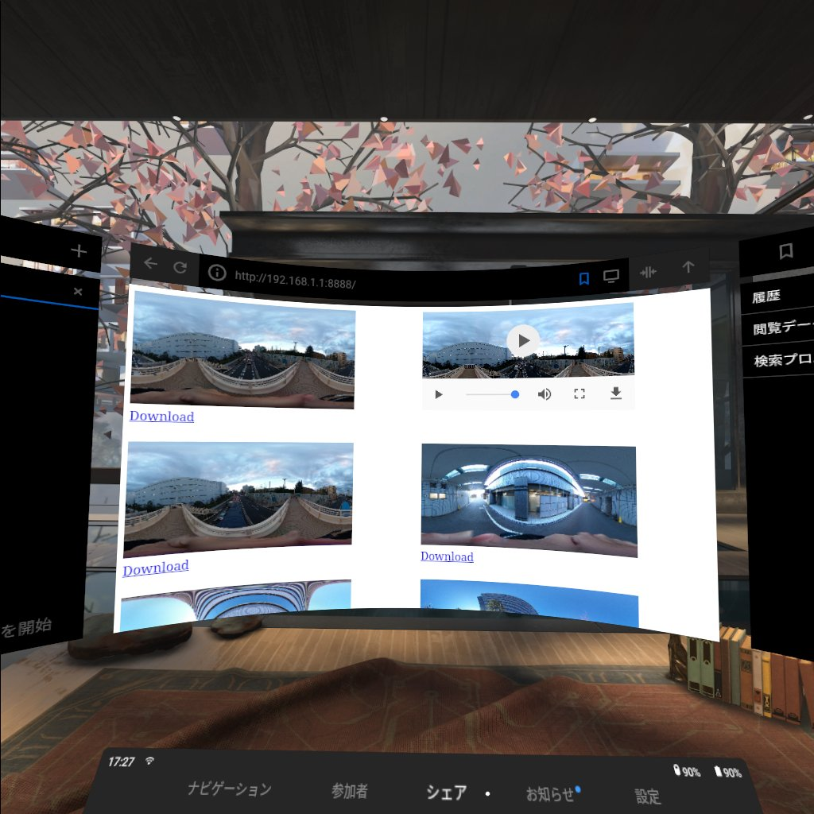
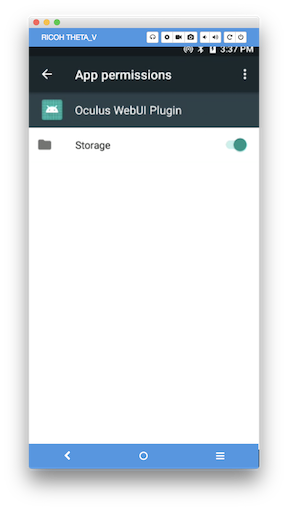
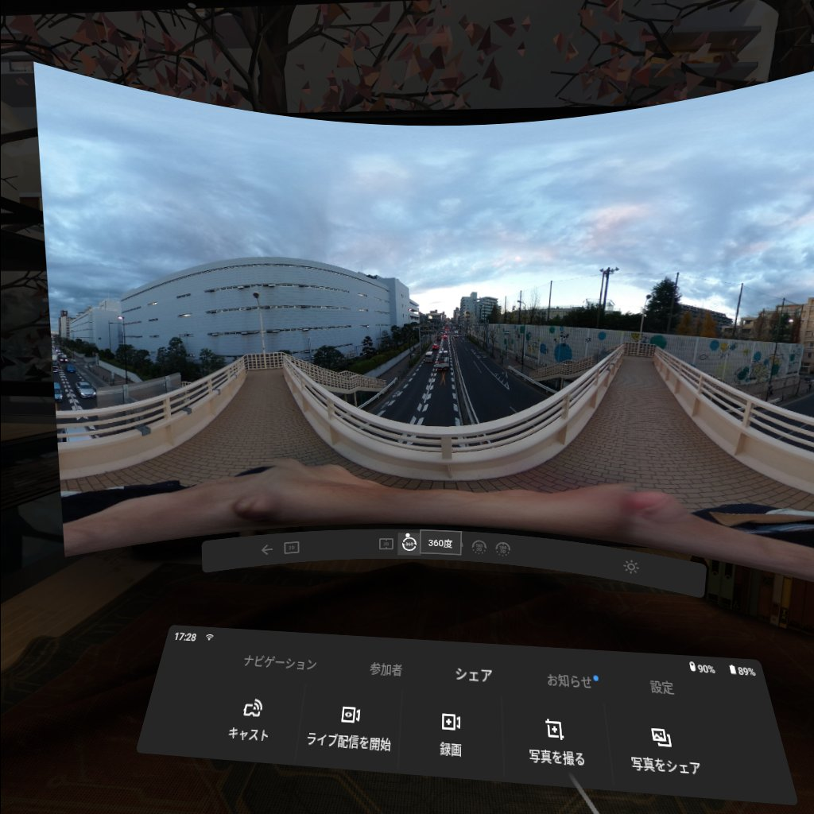

# Oculus WebUI plug-in Sample for RICOH THETA
This sample plug-in provides WebUI for Oculus Go web browser.<br>
This project is based on [ricohapi/theta-plugin-sdk](https://github.com/ricohapi/theta-plugin-sdk).



## Set up
* Download this project using git clone.

```
$ git clone https://github.com/ricohapi/theta-plugin-oculus-webui-sample
```

* Import this project by Android Studio.
* Build the plug-in and install to the THETA.
* Set up app permissions manually after the installation.<br>
Enable the permissions of "Storage".<br>


## Usage
* Connect Wi-fi of Oculus go to THETA V before running plug-in.
* To run plug-in mode, press and hold the mode button.
* For AP (direct) mode, access `http://192.168.1.1:8888` by web browser of Oculus Go.
* For CL (client) mode, check IP address by RICOH THETA apps for smartphone and access `http://[IP Address of THETA V]:8888` by web browser of Oculus Go.
* Click the image which you want to see.
* Select "360" from the menu.



## Development Environment
### Camera
* RICOH THETA V Firmware ver.2.50.1 and above

### SDK/Library
* [RICOH THETA Plug-in SDK ver.1.0.2](https://github.com/ricohapi/theta-plugin-sdk/tree/v1.0.2)
* [NanoHTTPD](https://github.com/NanoHttpd/nanohttpd)
* [JMustache](https://github.com/samskivert/jmustache)

### Development Software
* Android Studio ver.3.1
* gradle ver.4.6


## License

```
Copyright 2018 Ricoh Company, Ltd.

Licensed under the Apache License, Version 2.0 (the "License");
you may not use this file except in compliance with the License.
You may obtain a copy of the License at

    http://www.apache.org/licenses/LICENSE-2.0

Unless required by applicable law or agreed to in writing, software
distributed under the License is distributed on an "AS IS" BASIS,
WITHOUT WARRANTIES OR CONDITIONS OF ANY KIND, either express or implied.
See the License for the specific language governing permissions and
limitations under the License.
```
